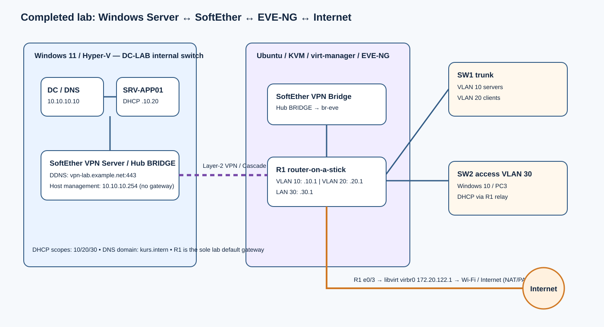
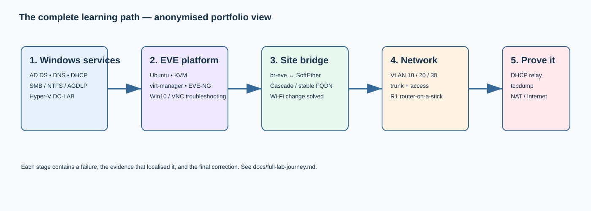

# Windows Server, Hyper-V, EVE-NG & SoftEther Network Lab

> A documented, working lab journey that joins a Windows Server domain environment in Hyper-V to an EVE-NG topology on Ubuntu through a SoftEther Layer-2 bridge. The finished lab provides routed VLANs, DHCP relay, DNS/Active Directory reachability, SMB file services, and Internet access through Cisco NAT/PAT.





**The key picture:** Hyper‑V does not connect to EVE‑NG by magic. The Windows `DC-LAB` internal switch is carried as Layer‑2 by SoftEther; Ubuntu exposes that bridge as `br-eve`; EVE‑NG connects the bridge to Cisco R1; R1 performs VLAN routing, DHCP relay, and NAT. The diagram above is the complete relationship between the three platforms.

## The story in one minute

This project took several weeks of hands-on troubleshooting. It began with Windows Server services and an internal Hyper‑V network, then moved to Ubuntu/KVM/EVE‑NG. The first direct EVE↔Hyper‑V attempt was not stable. SoftEther was introduced as the missing Layer‑2 transport, and the final design was completed with Cisco routing and Internet NAT.

```text
Windows 11 / Hyper‑V                 Ubuntu / EVE‑NG
DC-LAB internal switch               KVM + EVE cloud
        │                                  │
        └─ SoftEther Server ⇄ Bridge ─ br-eve
                                           │
                                     Cisco R1 + SW1/SW2
```

The project records both the failures and the evidence that solved them. Examples include a duplicate gateway/ARP conflict, wrong SW2 VLAN membership, an incorrect DHCP option 003, a missing DHCP response identified with `tcpdump`, a broken systemd unit, a changing Wi‑Fi Cascade address, and confusion between DNS and the default gateway.

## What was achieved

| Capability | Final result |
| --- | --- |
| Windows infrastructure | Example DC/DNS at `10.10.10.10`; example DHCP/file server `10.10.10.20` |
| Virtualisation | Windows 11 Hyper-V `DC-LAB` internal switch; Ubuntu runs EVE-NG/KVM/virt-manager |
| Cross-host Layer 2 | EVE `br-eve` bridged through SoftEther to the Windows `DC-LAB` network |
| Routing | Cisco R1 router-on-a-stick for VLANs 10/20 and routed LAN 30 |
| DHCP | Remote scopes served through R1 `ip helper-address` |
| Domain services | Clients use example DC DNS (`10.10.10.10`) and can join `kurs.intern` after network validation |
| Internet | R1 NAT/PAT via example libvirt `virbr0` (`172.20.122.1`) |
| Resilience to Wi-Fi address changes | SoftEther Cascade uses a stable FQDN, not a changing Wi-Fi IP |

## Network plan

| Segment | Addressing | Gateway | Purpose |
| --- | --- | --- | --- |
| VLAN 10 | `10.10.10.0/24` | `10.10.10.1` | Servers, carried over the SoftEther bridge |
| VLAN 20 | `10.10.20.0/24` | `10.10.20.1` | EVE clients, tagged on the R1/SW1 trunk |
| VLAN 30 | `10.10.30.0/24` | `10.10.30.1` | Windows 10 / PC3 through SW2 access ports |
| R1 WAN | `172.20.122.0/24` | `172.20.122.1` | Example libvirt NAT network |

Important fixed roles:

```text
R1 e0/0.10      10.10.10.1     VLAN 10 gateway
R1 e0/0.20      10.10.20.1     VLAN 20 gateway / DHCP relay
R1 e0/1         10.10.30.1     LAN 30 gateway / DHCP relay
DC/DNS          10.10.10.10
SRV-APP01 DHCP  10.10.10.20
Windows host    10.10.10.254 management only; no default gateway on DC-LAB
Domain          kurs.intern
```

## Read this first

This is a reconstruction from several lab conversations and verified command outputs. Every address, public hostname, Wi-Fi address, person name, account name, and password has been anonymised or replaced with a teaching example. It intentionally does **not** include passwords, VPN secrets, exported VMs, or a claimed configuration dump that was never captured. Values marked **[confirm]** must be checked in the live lab before reuse.

Start with [Architecture](docs/architecture.md), then follow [Full lab journey](docs/full-lab-journey.md), [Journey reflection](docs/journey-reflection.md), and [Build and validation](docs/build-and-validation.md). The recorded failure-to-fix path is in [Troubleshooting timeline](docs/troubleshooting-timeline.md).

## Why the final topology works

1. **Transport:** SoftEther connects the two hosts and keeps the Cascade on a stable FQDN.
2. **Layer 2:** `br-eve`, hub `BRIDGE`, SW1 trunk, and SW2 access VLAN 30 carry the frames.
3. **Layer 3:** R1 owns `10.10.10.1`, `10.10.20.1`, and `10.10.30.1`; those are the only client gateways.
4. **Services:** DHCP lives on the server VLAN; R1 relays remote broadcasts; DC DNS remains the DNS authority.
5. **Internet:** R1 marks inside/outside interfaces and PATs the three lab networks through the example libvirt WAN.

Never infer success from one green status: confirm the service, Cascade, bridge, VLAN, relay packet, lease options, route, DNS lookup, and NAT translation in that order.

## Repository map

```text
assets/                 final SVG topology
configs/cisco/          reference IOS configurations
configs/linux/          command and service-repair reference
configs/powershell/     Windows Server / DHCP reference commands
docs/                   architecture, build, troubleshooting, tests, lessons
```

## Final validation sequence

1. On Linux: ensure `softether-vpnbridge` is active; in `vpncmd`, confirm Cascade is `Online (Established)` and `BridgeList` says `br-eve Operating`.
2. On R1: ping `10.10.10.10`, `10.10.10.20`, `172.20.122.1`, and an Internet IP.
3. Renew a VLAN 20 or VLAN 30 client lease. Verify its router option is in the same subnet.
4. From a client: gateway → DC → `8.8.8.8` → `nslookup google.com`.
5. On R1: inspect `show ip nat translations` while a client uses the Internet.

Full commands and expected evidence are in [Test plan](docs/test-plan.md).

## Security note

Replace illustrative DNS forwarders and any example account names with your policy-approved values. Never commit SoftEther passwords, Windows credentials, private keys, or VM disks.
